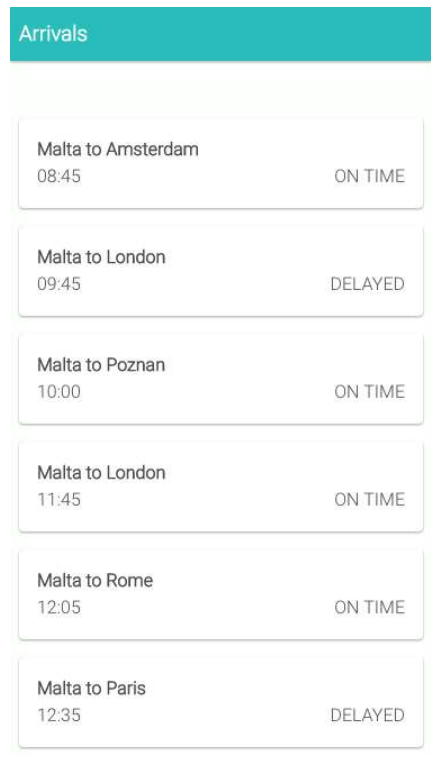

# Flight list app

## VIEW
Create blocks with flight departure times

## MODEL
Local JSON file for now

## CONTROL
Make it a PWA by implementing 4 necessary shit.
Errrm, vanilla or angular?
Meh, vanilla for 30 mins, then fuck go angular. Svelte would be nice though....

Initialize for online
Have an offline page in case of offline detection

### notes to melf
it went well that day.
now it doesn't. oh well, at least i try.
but you suck, you say?
yeah i do, hip hip hooray!
